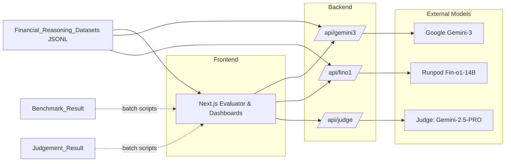
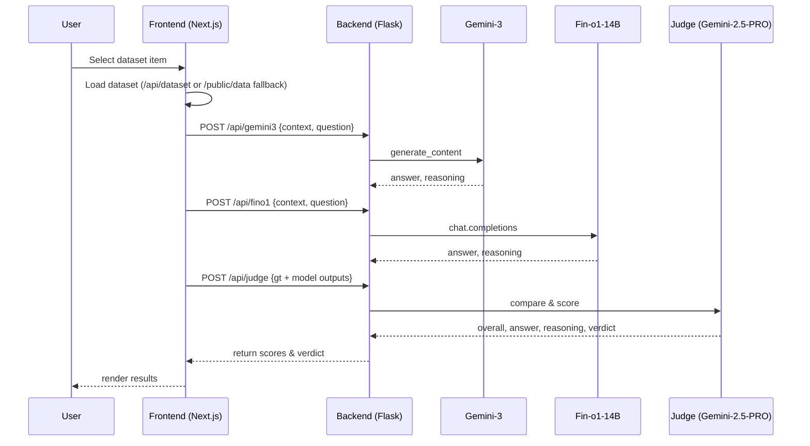

# FinEval: LLM Financial Reasoning Benchmark

A unified benchmark to evaluate Large Language Models on financial reasoning tasks. It provides:
- An interactive Next.js frontend to run evaluations and visualize scores.
- A Flask backend exposing endpoints to query models and a judge.
- Batch scripts to generate model outputs and judge results across datasets.

The project compares Google Gemini‑3 and Fin‑o1‑14B on curated financial questions, then uses a judge model to score answer accuracy and reasoning quality.

## Project Structure
- `frontend/fin_eval_frontend/`: Next.js app with dashboards and an interactive evaluator UI.
- `backend/`: Flask API server and Python helpers for Gemini‑3, Fin‑o1, and judging.
- `Financial_Reasoning_Datasets/`: JSONL datasets (e.g., `easy.jsonl`, `hard.jsonl`).
- `Gemini3/` and `Fin_o1/`: Batch benchmarking and judgment scripts plus saved results.

## Folder Structure

```
FinEval-LLM-Financial-Reasoning-Benchmark/
├── backend/
│   ├── __init__.py
│   ├── api_server.py
│   ├── fin_o1.py
│   ├── gemini_3_model.py
│   └── judge.py
├── documents/
│   ├── DEPLOYMENT_SUMMARY.md
│   ├── README_BACKEND.md
│   ├── README_DEPLOYMENT.md
│   └── RENDER_SETUP.md
├── frontend/
│   └── fin_eval_frontend/
│       ├── app/
│       │   ├── api/
│       │   │   └── dataset/
│       │   │       └── route.ts
│       │   ├── dashboards/
│       │   │   ├── easy/page.tsx
│       │   │   ├── fin01/
│       │   │   │   ├── easy/page.tsx
│       │   │   │   ├── hard/page.tsx
│       │   │   │   ├── medium/page.tsx
│       │   │   │   ├── overall/page.tsx
│       │   │   │   └── page.tsx
│       │   │   ├── gemini/
│       │   │   │   ├── easy/page.tsx
│       │   │   │   ├── hard/page.tsx
│       │   │   │   ├── medium/page.tsx
│       │   │   │   ├── overall/page.tsx
│       │   │   │   └── page.tsx
│       │   │   ├── hard/page.tsx
│       │   │   ├── medium/page.tsx
│       │   │   └── overall/page.tsx
│       │   ├── evaluator/page.tsx
│       │   ├── fun-facts/page.tsx
│       │   ├── favicon.ico
│       │   ├── globals.css
│       │   ├── layout.tsx
│       │   ├── normalize.css
│       │   └── page.tsx
│       ├── components/
│       │   ├── DashboardStats.tsx
│       │   ├── DashboardTable.tsx
│       │   ├── Header.module.css
│       │   └── Header.tsx
│       ├── lib/
│       │   ├── funFact.ts
│       │   └── judgmentData.ts
│       ├── public/
│       │   ├── data/
│       │   │   ├── fin_o1_easy.jsonl
│       │   │   ├── fin_o1_hard.jsonl
│       │   │   ├── fin_o1_medium.jsonl
│       │   │   ├── gemini3_easy.jsonl
│       │   │   ├── gemini3_hard.jsonl
│       │   │   ├── medium.jsonl
│       │   │   └── funFact.ts
│       │   ├── fin_o1_easy_judgement.jsonl
│       │   ├── fin_o1_hard_judgement.jsonl
│       │   ├── fin_o1_medium_judgement.jsonl
│       │   ├── gemini3_easy_judgement.jsonl
│       │   ├── gemini3_hard_judgement.jsonl
│       │   ├── gemini3_medium_judgement.jsonl
│       │   ├── file.svg
│       │   ├── globe.svg
│       │   ├── next.svg
│       │   ├── vercel.svg
│       │   └── window.svg
│       ├── .gitignore
│       ├── README.md
│       ├── README_VERCEL.md
│       ├── eslint.config.mjs
│       ├── next.config.ts
│       ├── package-lock.json
│       ├── package.json
│       ├── postcss.config.mjs
│       ├── tsconfig.json
│       └── vercel.json
├── .gitignore
├── .vercel/
│   └── project.json
├── .vercelignore
├── Procfile
├── app.py
├── render.yaml
├── requirements.txt
├── runtime.txt
├── vercel.json
├── wsgi.py
└── README.md
```

Key backend entry points:
- `backend/api_server.py` exposes `GET /health`, `POST /api/gemini3`, `POST /api/fino1`, `POST /api/judge`.
  - Endpoints defined in `backend/api_server.py:48`, `backend/api_server.py:65`, `backend/api_server.py:82`.
- Gemini helper: `backend/gemini_3_model.py` (model call and parsing).
- Fin‑o1 helper: `backend/fin_o1.py` (Runpod call and robust parsing).
- Judge helper: `backend/judge.py` (Gemini‑2.5‑PRO comparison/scoring).

## Installation

### Prerequisites
- Python `>=3.10` (recommended 3.11)
- Node.js `>=18.18` (Next.js 16), npm
- API keys:
  - `GEMINI_API_KEY` (Google Generative AI / Gemini)
  - `FINO1_API_KEY` (Runpod / TheFinAI Fin‑o1‑14B)

### Backend Setup (Local)
1. Create and activate a virtual environment (optional but recommended).
2. Install dependencies from `requirements.txt`:
   ```bash
   pip install -r requirements.txt
   ```
3. Set environment variables (or create a `.env` at project root):
   ```bash
   export GEMINI_API_KEY=your_google_genai_key
   export FINO1_API_KEY=your_runpod_key
   ```
4. Run the API server:
   ```bash
   # Development
   python backend/api_server.py

   # Production-like (Gunicorn via WSGI)
   gunicorn --bind 0.0.0.0:8000 wsgi:app
   ```
   The server listens on `http://127.0.0.1:8000`.

### Frontend setup
1. Install dependencies:
   ```bash
   cd frontend/fin_eval_frontend
   npm install
   ```
2. (Optional) Configure backend URL for Next.js rewrites:
   ```bash
   # If your backend runs elsewhere
   export NEXT_PUBLIC_API_URL=http://127.0.0.1:8000
   ```
3. Start the dev server:
   ```bash
   npm run dev
   # Visit http://localhost:3000
   ```

Notes:
- The evaluator page directly targets `http://127.0.0.1:8000/api` by default (`frontend/fin_eval_frontend/app/evaluator/page.tsx:27`).
- Dataset loading in the evaluator first attempts `/api/dataset?file=easy.jsonl`, then falls back to `public/data/medium.jsonl` (`frontend/fin_eval_frontend/app/evaluator/page.tsx:48-65`). Place JSONL files under `frontend/fin_eval_frontend/public/data/` if you don’t expose a dataset API.

## Deployment

### Backend (Render)
- Status: deployed and running
- URL: `https://fineval-llm-financial-reasoning-benchmark.onrender.com`
- Health: `https://fineval-llm-financial-reasoning-benchmark.onrender.com/health`
- Framework: Flask + Gunicorn
- Entry points: `wsgi.py` (preferred), `app.py` (fallback)

Key Render settings:
- Root Directory: `.` (project root)
- Build Command: `pip install -r requirements.txt`
- Start Command: `gunicorn --bind 0.0.0.0:$PORT --workers 2 --timeout 120 wsgi:app`
- Environment: Python 3

Environment variables in Render:
- `GEMINI_API_KEY` = your Gemini API key
- `FINO1_API_KEY` = your Fin‑o1 API key
- `PORT` = provided by Render

Endpoints when deployed:
- `https://fineval-llm-financial-reasoning-benchmark.onrender.com/api/gemini3`
- `https://fineval-llm-financial-reasoning-benchmark.onrender.com/api/fino1`
- `https://fineval-llm-financial-reasoning-benchmark.onrender.com/api/judge`
- `https://fineval-llm-financial-reasoning-benchmark.onrender.com/health`

Troubleshooting (Render):
- 404 on root URL is expected; use `/health`.
- If `ModuleNotFoundError: No module named 'app'`, ensure Root Directory = `.` and Start Command uses `wsgi:app` or `app:app`.
- Verify `requirements.txt` install succeeded and `wsgi.py`/`app.py` exist in project root.

### Frontend (Vercel)
- Framework: Next.js 16
- Root Directory: `frontend/fin_eval_frontend`

Deployment steps:
- Connect repository in Vercel and set Root Directory to `frontend/fin_eval_frontend`.
- Set `NEXT_PUBLIC_API_URL` to the backend base URL (without `/api`), e.g. `https://fineval-llm-financial-reasoning-benchmark.onrender.com`.
- Deploy; Vercel builds and serves at the assigned URL.

API rewrites:
- When `NEXT_PUBLIC_API_URL` is set, frontend calls to `/api/*` are rewritten to `${NEXT_PUBLIC_API_URL}/api/*`.
- In local dev without the env var, rewrites target `http://localhost:8000/api/*`.

## Usage Examples

### 1) Interactive UI
- Open `http://localhost:3000/evaluator` and select a task.
- Click “Run Evaluation” to query Gemini‑3 and Fin‑o1, then view judge scores and verdict.

### 2) Curl the API
```bash
# Gemini‑3
curl -X POST http://127.0.0.1:8000/api/gemini3 \
  -H 'Content-Type: application/json' \
  -d '{"context":"A company has $10M revenue...","question":"What is gross margin if COGS is $6M?"}'

# Fin‑o1‑14B
curl -X POST http://127.0.0.1:8000/api/fino1 \
  -H 'Content-Type: application/json' \
  -d '{"context":"A fund charges 2% management fee...","question":"Fee on $1,250,000 AUM?"}'

# Judge (Gemini‑2.5‑PRO)
curl -X POST http://127.0.0.1:8000/api/judge \
  -H 'Content-Type: application/json' \
  -d '{
        "context":"...",
        "question":"...",
        "gt_answer":"4,000,000",
        "gt_reasoning":"Revenue minus COGS",
        "model_answer":"4,000,000",
        "model_reasoning":"Computed margin"
      }'
```

### 3) Python CLI scripts
```bash
# Single item to Gemini‑3
python backend/gemini_3_model.py --context "..." --question "..."

# Single item to Fin‑o1
python backend/fin_o1.py --context "..." --question "..."

# Judge a dataset item (auto-generates candidate via Gemini‑3 if not provided)
python backend/judge.py --from_jsonl Financial_Reasoning_Datasets/easy.jsonl --index 0
```

### 4) Batch benchmarking
```bash
# Gemini‑3 over the easy split
python Gemini3/Benchmark_Script/gemini3_batch_easy.py

# Fin‑o1 over the easy split
python Fin_o1/Benchmark_Scripts/fin_o1_easy.py
```
Outputs are written to `Gemini3/Benchmark_Result/` and `Fin_o1/Benchmark_Result/`. Judgement JSONL files are saved in `Gemini3/Judgement_Result/` and `Fin_o1/Judgement_Result/`.

## Configuration
Create a `.env` file at the project root or export environment variables:
```env
GEMINI_API_KEY=your_google_genai_key
FINO1_API_KEY=your_runpod_key
# Optional for Next.js rewrites
NEXT_PUBLIC_API_URL=http://127.0.0.1:8000
```

## Quick Links
- Backend Health: `https://fineval-llm-financial-reasoning-benchmark.onrender.com/health`
- Render Dashboard: https://dashboard.render.com
- Vercel Dashboard: https://vercel.com/dashboard

## System Architecture

```mermaid
flowchart TD
    Start([Start Evaluation]) --> Context[Financial Context<br/>Statements/Scenarios]
    
    
    Context --> Model1[Gemini 3 Model<br/>&#40;POST /api/gemini3&#41;]
    Context --> Model2[Fin-o1-14B Model<br/>&#40;POST /api/fino1&#41;]
    Context --> Reference[Correct Answer<br/>& Reasoning]
    
    Model1 --> Output1[Model Output<br/>Answer + Reasoning]
    Model2 --> Output2[Model Output<br/>Answer + Reasoning]
    
    Output1 --> Judge[Judge: Gemini-2.5-PRO<br/>&#40;POST /api/judge&#41;]
    Output2 --> Judge
    Reference --> Judge
    
    Judge --> Scoring[Evaluation Scoring<br/>Overall = Answer*0.6 + Reasoning*0.4]
    
    Scoring --> AnswerScore[Answer Score %<br/>Numeric Accuracy]
    Scoring --> ReasoningScore[Reasoning Score %<br/>Logical Consistency]
    Scoring --> Flags[Overall Score]
    
    AnswerScore --> Comparison[Model Comparison<br/>Gemini 3 vs Fin-o1-14B]
    ReasoningScore --> Comparison
    Flags --> Comparison
    
    Comparison --> Report[Frontend Dashboard]
    
    Report --> End([End Evaluation])

```





### Evaluation Workflow



## Data & Results
- Datasets: `Financial_Reasoning_Datasets/easy.jsonl`, `Financial_Reasoning_Datasets/hard.jsonl` (JSONL lines with `context`, `question`, `answer`, `reasoning`).
- Frontend fallback datasets: `frontend/fin_eval_frontend/public/data/`.
- Batch outputs:
  - Gemini‑3: `Gemini3/Benchmark_Result/gemini3_<split>.jsonl`
  - Fin‑o1: `Fin_o1/Benchmark_Result/fin_o1_<split>.jsonl`
  - Judgements: `Gemini3/Judgement_Result/` and `Fin_o1/Judgement_Result/`

## Authors & Acknowledgements
- Taha Ahmad
- Muhammad Usman
- Tom Zhang
